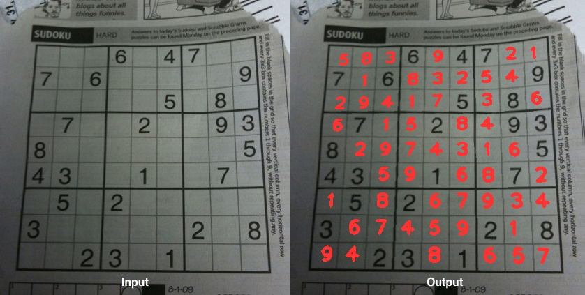

# Sudoku Solver

A project to create a Sudoku solver from images for educational purposes to explore themes of:

* Puzzle Solving Algorithms
* Computer Vision
* Machine Learning


The `Sudoku` class can take images as an input and produce solved puzzles as an output. Output can be as a formatted string, dictionary or overlayed on the original image.

```python
from Sudoku import Sudoku

example = Sudoku('data/images/grid/all/0.jpg')
example.show_completed()
```



**Current Accuracy:**

The best model (stored in `data/best-model`) has achieved 93.33% success on the images in `data/images/grid/all`, with 7 digits mis-categorised.


## Modules/Folders

* `Sudoku`: Main class that uses all of the modules to extract Sudoku boards from images and solve them. Has numerous display functions for viewing the output.
* `computer_vision`: Module for image processing, used to identify extract the Sudoku grid from an image.
* `data`
    * `best-model`: The current best neural network, version controlled. All other models are ignored from version control for brevity.
    * `datasets`: Pickle files with the image data stored as separated training and test sets. Version controlled so others can train equivalent models.
    * `images`: Sudoku board photographs for training and testing. The full set is version controlled, but training/test splits are not. Also contains the individual digits that have been extracted and classified, but these are not version controlled.
    * `models`: Tensorflow checkpoints of each type of model that was tested. These are not version controlled.
    * `puzzles`: Sudoku puzzles in string format, for unit tests.
    * `run-history.xlsx`: Record of previous runs for different models along with their performance in terms of speed and accuracy.
* `neural_net`: Tensorflow module containing a convolutional neural network for digit recognition. Also has a helper class for creating usable input datasets from images.
* `solver`: Puzzle solving module, broadly a reimplementation of Peter Norvig's [solution](http://norvig.com/sudoku.html), with additional functions for handling input and printing output.
* `tests`: Unit tests for the project, including tests for puzzle solving, model training, digit recognition and board recognition.

## Useful Scripts

* `parse_grid.py`
    * `test_board_recognition`: Tests all the grids in the set and reports on accuracy and success
    * `auto_classify` can extract each cell from a board and save it to subfolder in `data/images/classified` as determined
    from the *classification mode*.
* `train_digits.py`
    * Can load classified images and create a training and test dataset from them, saving to a `pickle` file in `data/datasets`.
    The name of the file will depend on the *classification mode* when using `create_digit_set`.
    * Can train a model (saving every 100 steps) from a dataset.

## Other Models

Due to the size of the individual model files, they have not been all kept in Git. There is an Excel spreadsheet
(`data/run-history.xlsx`) that describes all of the different classification methods that have been tried and the training
data for all of these is present in `data/classified`.

Creating a `config.ini` will allow you to create datasets from the grids more easily by changing the *Classification Mode*.

```
[CLASSIFICATION]
Mode=digit-adaptive
```

Changing this value will automatically change the sub-directories for loading models as well as saving images and datasets.
The `Sudoku` class has handlers for this setting that change the way the digit extraction occurs, depending on which mode you
are in. This should help to keep track of training sets, models and pre-processing.
